# AI-Powered Recipe Generator 🍳

## Transform Your Cooking Experience with Artificial Intelligence

AI-Powered Recipe Generator is an intelligent cooking assistant that creates personalized recipes based on your taste preferences, dietary restrictions, and available ingredients. Powered by Google's Gemini AI, this app helps you discover new dishes, reduce food waste, and cook smarter.


## ✨ Key Features

### 🎯 Personalized Recipe Generation

- **AI-Powered Creation**: Generate unique recipes using Google Gemini AI

- **Taste Profile Integration**: Recipes tailored to your spice preferences, dietary restrictions, and cooking style

- **Smart Adaptations**: Automatic ingredient substitutions for allergies and dislikes

### 🏠 Smart Kitchen Management

- **Pantry Tracking**: Keep track of your ingredients and get usage suggestions

- **Leftovers Transformation**: Turn leftover ingredients into delicious new meals

- **Waste Reduction**: Creative recipes that help reduce food waste

### 👤 User-Centric Experience

- **Taste Profiles**: Comprehensive preference system (likes, dislikes, allergies, dietary needs)

- **Saved Recipes**: Personal collection of favorite generated recipes

- **Multi-Language Support**: Generate recipes in your preferred language

### 🔧 Technical Excellence

- **Modern Stack**: React + TypeScript frontend, FastAPI backend

- **Real-time AI**: Instant recipe generation with intelligent personalization

- **Secure Authentication**: JWT-based user system with protected routes

## 🚀 Quick Start

### Prerequisites

- Python 3.8+

- PostgreSQL database

- Google Gemini API key

### Installation Steps

1\. **Clone the Repository**

```bash

git clone https://github.com/Vismaya-a/AI-Powered-RECIPE-APP.git

cd AI-Powered-RECIPE-APP

```

2\. **Backend Setup**

```bash

cd backend

python -m venv venv

source venv/bin/activate  # On Windows: venv\Scripts\activate

pip install -r requirements.txt

# Set up environment variables

cp .env.example .env

# Add your DATABASE_URL and GEMINI_API_KEY to .env

# Run database migrations


# Start the backend server

uvicorn main:app --reload

```

3\. **Frontend Setup**

```bash

cd frontend

npm install


# Configure your API endpoints

# Start the development server

npm run dev

```

4\. **Access the Application**

- Frontend: http://localhost:5173

- Backend API: http://localhost:8000

- API Documentation: http://localhost:8000/docs

## 🖼️ Application Screenshots

### User Interface

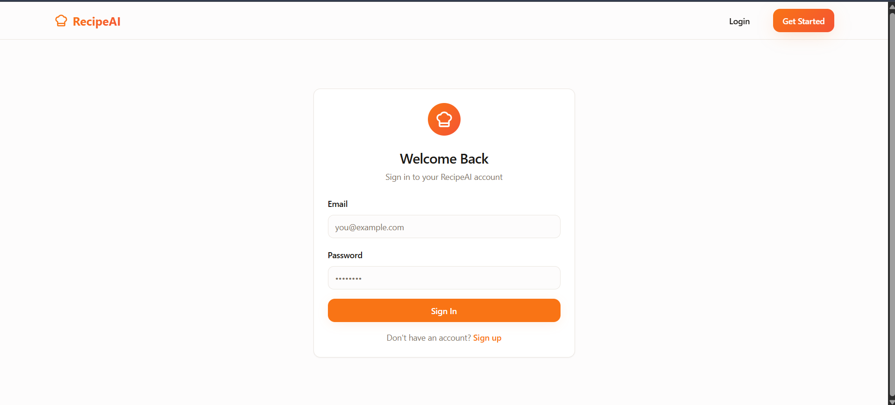 <!-- Replace with actual login screenshot -->

*Clean and modern login interface*

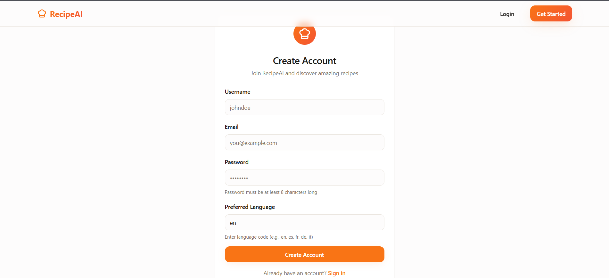 <!-- Replace with actual registration screenshot -->

*Streamlined user registration process*

### Core Features

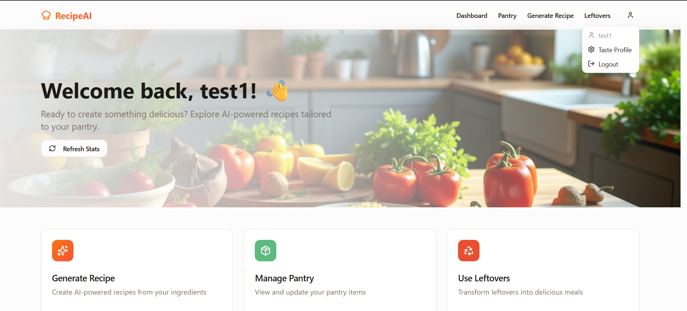
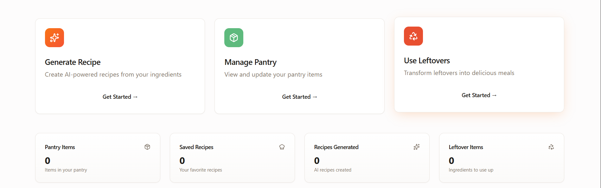


*Personalized dashboard with quick access to all features*

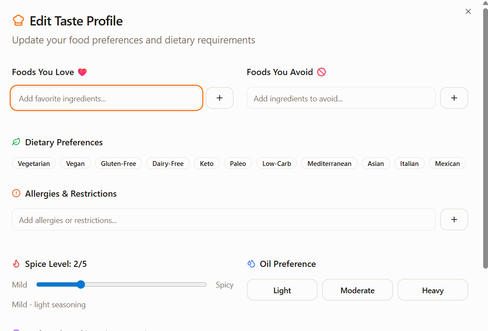 <!-- Replace with actual taste profile screenshot -->

*Comprehensive taste profile customization*

### Recipe Management

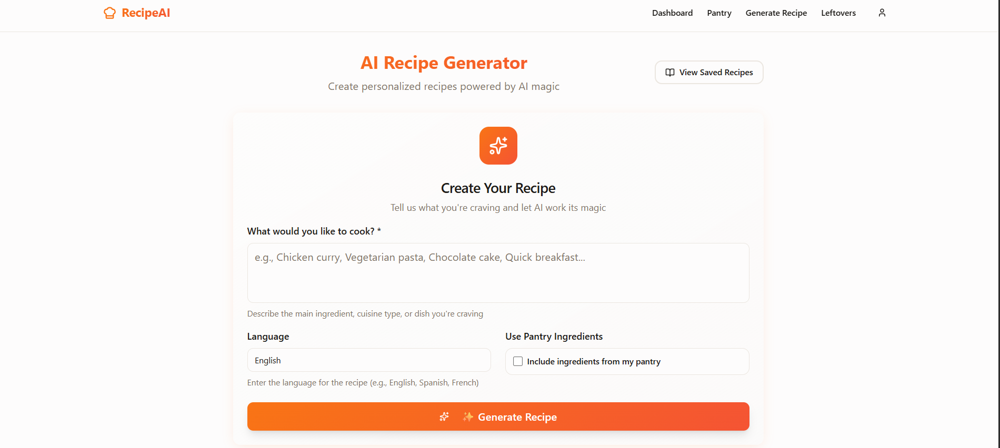
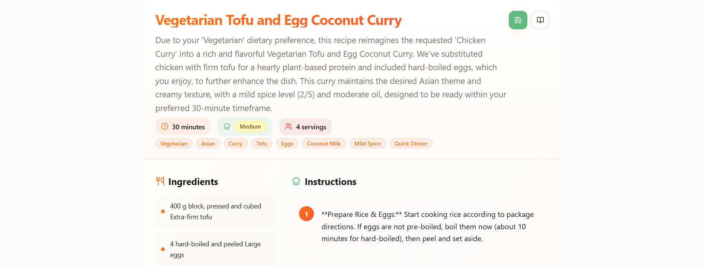
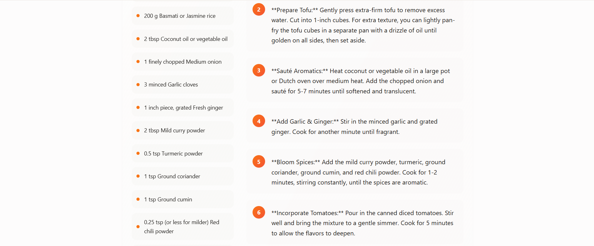 
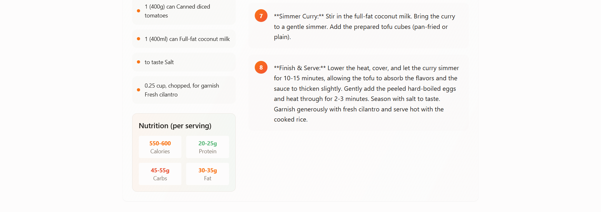 
 <!-- Replace with actual generation screenshot -->

*AI-powered recipe generation interface*

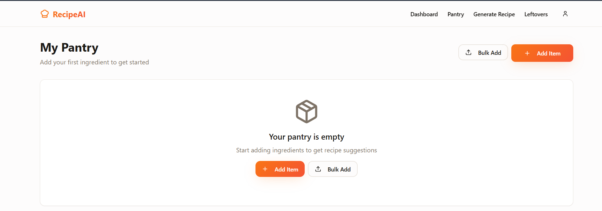 
*Smart pantry ingredient tracking*

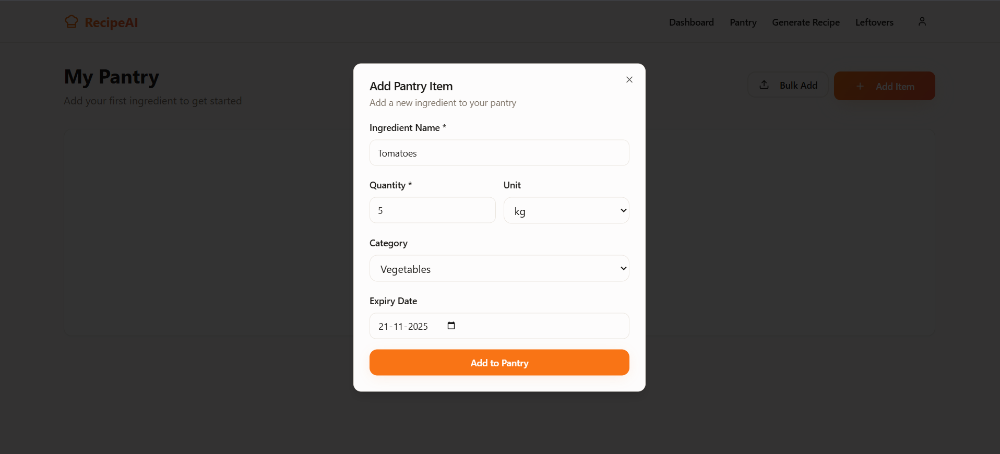
*Smart pantry ingredient tracking*


*Smart pantry ingredient tracking*


 

*Creative leftover ingredient transformation*

### Recipe Display

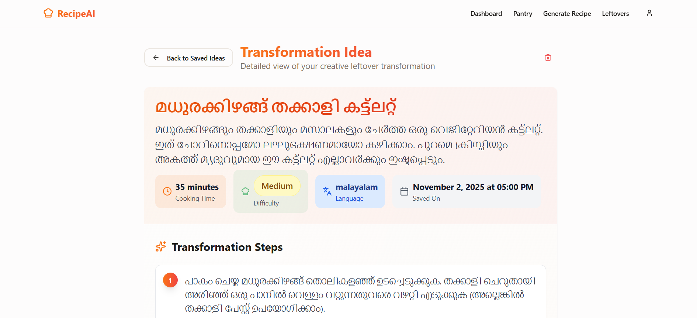
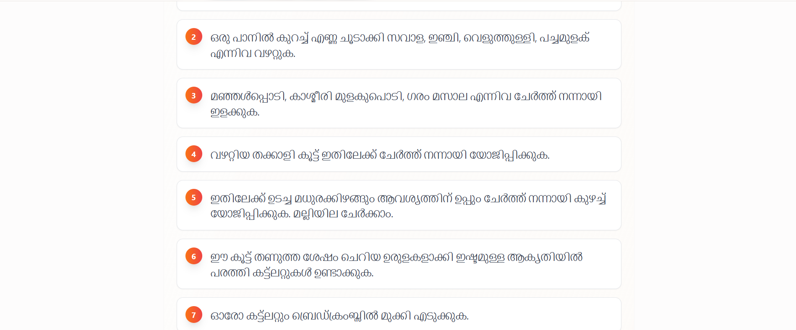
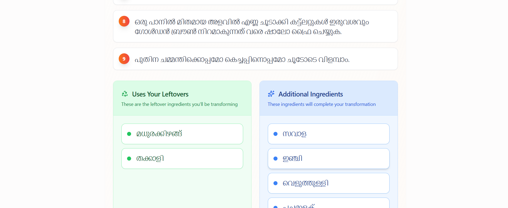
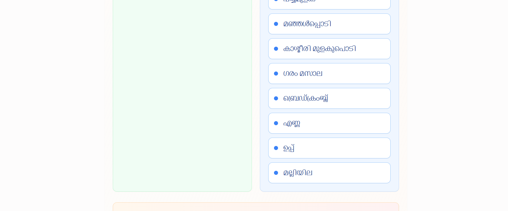


*Beautiful recipe presentation with ingredients and instructions*

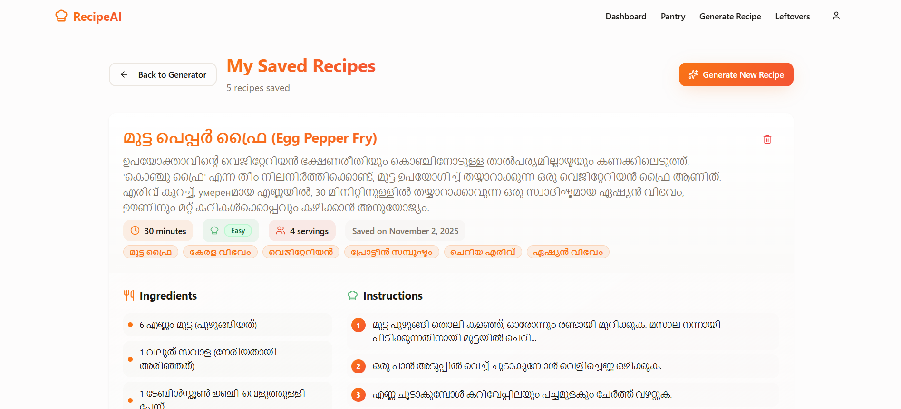
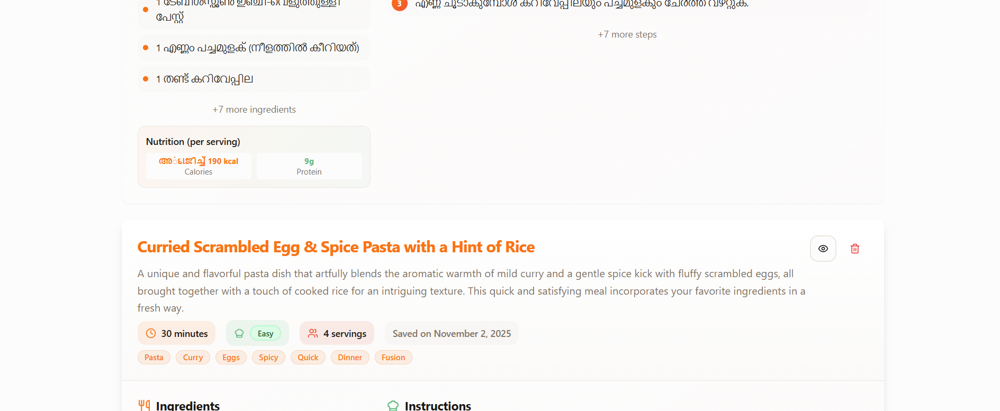
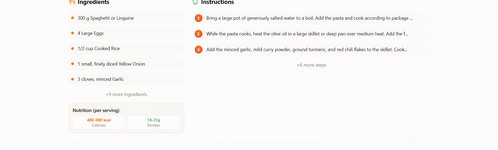

*Personal collection of favorite recipes*

## 🛠️ Technology Stack

### Frontend

- **React 18** with TypeScript

- **Tailwind CSS** for styling

- **React Router** for navigation

- **TanStack Query** for state management

- **Sonner** for toast notifications

- **Lucide React** for icons

### Backend

- **FastAPI** with Python 3.8+

- **SQLModel** for database ORM

- **PostgreSQL** for data storage

- **JWT** for authentication

- **Google Gemini AI** for recipe generation


## 📁 Project Structure

```

AI-Powered-RECIPE-APP/

├── backend/

│   ├── app/

│   │   ├── auth/          # Authentication routes

│   │   ├── users/         # User management

│   │   ├── recipes/       # Recipe generation

│   │   ├── leftovers/     # Leftovers transformation

│   │   ├── db/           # Database models

│   │   └── core/         # Config and middleware

│   ├── requirements.txt

│   

├── frontend/

│   ├── src/

│   │   ├── components/   # React components

│   │   ├── contexts/     # React contexts

│   │   ├── pages/        # Route components

│   │   ├── utils/        # API utilities

│   │   └── types/        # TypeScript definitions

│   └── package.json

└── README.md

```

## 🎯 How It Works

### 1. User Registration & Taste Profiling

- Users create accounts with personalized taste profiles

- Set preferences for spices, cooking time, dietary restrictions

- Configure allergies and ingredient dislikes

### 2. Intelligent Recipe Generation

- AI analyzes user preferences and requested theme

- Generates personalized recipes with nutritional information

- Automatically excludes allergic ingredients

- Adapts cooking style to match user preferences

### 3. Smart Kitchen Integration

- Track pantry ingredients

- Get recipe suggestions based on available items

- Transform leftovers into new meals

- Reduce food waste through creative recipes

### 4. Personal Recipe Management

- Save favorite generated recipes

- Organize personal recipe collection

- Quick access to frequently used recipes

## 🔧 API Endpoints

### Authentication

- `POST /auth/register` - User registration

- `POST /auth/login` - User login

- `POST /auth/logout` - User logout

### Recipes

- `POST /recipes/generate` - Generate AI recipes

- `GET /recipes/saved` - Get saved recipes

- `POST /recipes/save` - Save generated recipe

- `DELETE /recipes/saved/{id}` - Delete saved recipe

### User Management

- `GET /users/profile` - Get user profile

- `POST /users/taste-profile` - Create taste profile

- `PUT /users/taste-profile` - Update taste profile

### Pantry & Leftovers

- `GET /pantry/items` - Get pantry items

- `POST /pantry/items` - Add pantry item

- `POST /leftovers/transform` - Transform leftovers

- `GET /leftovers/saved` - Get saved transformations


#

## 📊 SEO Optimization

**Keywords**: AI recipes, meal planning, cooking assistant, food waste reduction, personalized recipes, smart kitchen, recipe generator, dietary restrictions, cooking app, leftovers recipes

**Tags**: `ai-cooking` `recipe-generator` `food-waste` `meal-planning` `dietary-restrictions` `smart-kitchen` `leftover-recipes` `cooking-assistant` `personalized-recipes` `nutrition-analysis`


---

<div align="center">

**⭐ Star this repository if you find it helpful!**

*Made with ❤️ by [Vismaya](https://github.com/Vismaya-a)*

</div>

---
